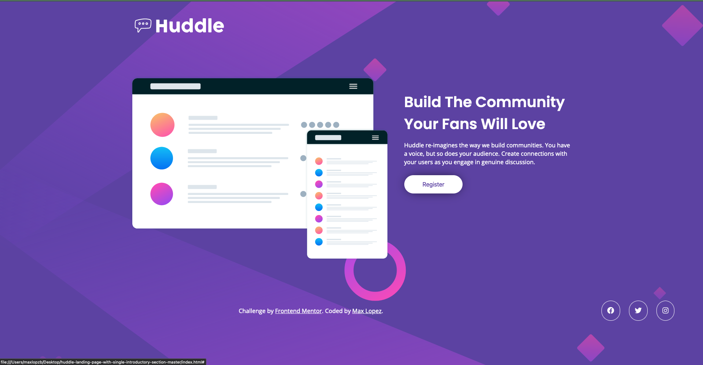
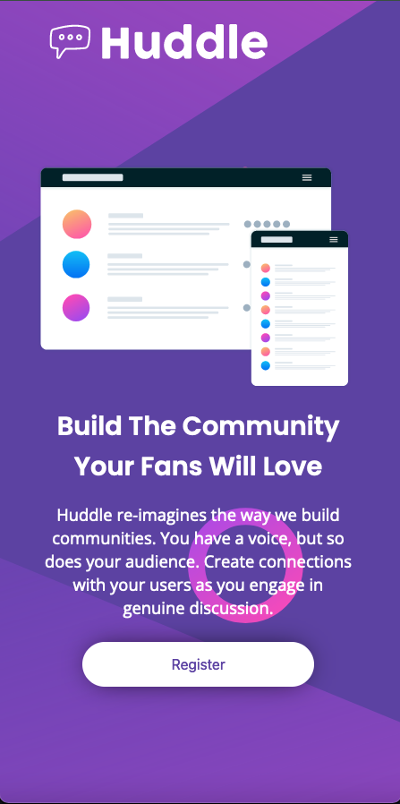

# Frontend Mentor - Huddle landing page with single introductory section solution

This is a solution to the [Huddle landing page with single introductory section challenge on Frontend Mentor](https://www.frontendmentor.io/challenges/huddle-landing-page-with-a-single-introductory-section-B_2Wvxgi0). Frontend Mentor challenges help you improve your coding skills by building realistic projects. 

## Table of contents

- [Overview](#overview)
  - [The challenge](#the-challenge)
  - [Screenshot](#screenshot)
  - [Links](#links)
- [My process](#my-process)
  - [Built with](#built-with)
  - [What I learned](#what-i-learned)
  - [Continued development](#continued-development)
  - [Useful resources](#useful-resources)
- [Author](#author)


## Overview

### The challenge

Users should be able to:

- View the optimal layout for the page depending on their device's screen size
- See hover states for all interactive elements on the page

### Screenshot





### Links

- Solution URL: [Add solution URL here](https://github.com/maxlopzb/huddle-landing-page)
- Live Site URL: [Add live site URL here](https://maxlopzb.github.io/huddle-landing-page/)

## My process

### Built with

- Flexbox
- Media queries
- Semantic HTML5
- Responsive images


### What I learned

I learned some new css-propiertes that i was not familiar with. For example: background-attachtment,etc. Also improve my knoweledge and understanding of flexbox and all of its properties. First time i make a webpage with so many changes based on the width of the viewport, so i was able to improve my skills on media queries. 


```css
footer {
  display: flex;
  align-items: center;
  justify-content: space-between;
  margin-top: 125px;
}
```


### Continued development

I want to get better at Grid layout, flexbox and css in general. Also i want to start creating websites with functionality using javascript. Want to improve my UX/UI knowledge and have the abilty to creat desings and convert them into real websites.


### Useful resources

- [Example resource 1](https://www.w3schools.com/) - w3schools is an excellent resource when you feel stuck at something. I use it when i need to remember a concept.


## Author

- Frontend Mentor - [@maxlopzb](https://www.frontendmentor.io/profile/maxlopzb)
- Twitter - [@maxlopzb17](https://www.twitter.com/maxlopzb17)

